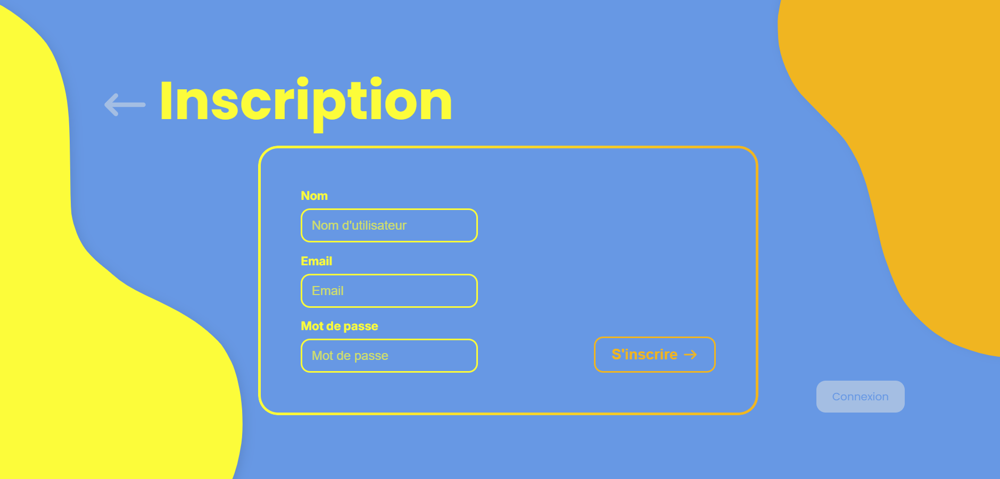

# MatchaDesign

> Projet en cours de développement (certaines fonctionnalités sont en construction.)

> Projet backend d'apprentissage visant à mettre en place un serveur Node.js avec Express, relié à une base de données SQLite3, et connecté à un frontend déjà existant.

> Mise en place d'un profil et d'une session utilisateur personnalisé




## Inspiration 
- Palette de couleur sur pinterest
- De nombreux projet moderne sur dribble

## Fonctionnalités actuelles
- API REST avec routes GET et POST
- Base de données **SQLite3** stockée en local (`./database/inscriptionNews.db`)
- Création automatique des tables :
  - **newsletter** : inscription à la newsletter (email unique)
  - **users** : gestion des utilisateurs (username, email, mot de passe hashé)
- Tests des endpoints avec Postman

## Technologies
- Node.js / Express
- SQLite3 (MySQL à venir)
- JavaScript (ES6+)
- Postman (tests API)

## Installation
```bash
# Cloner le projet
git clone https://github.com/BuonomoLea/MatchaDesign.git

Installer les dépendances et lancer le serveur
