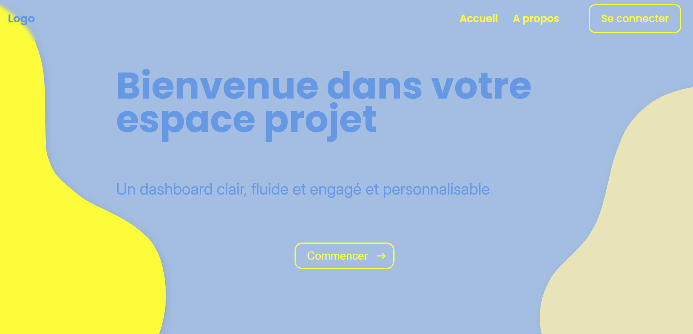
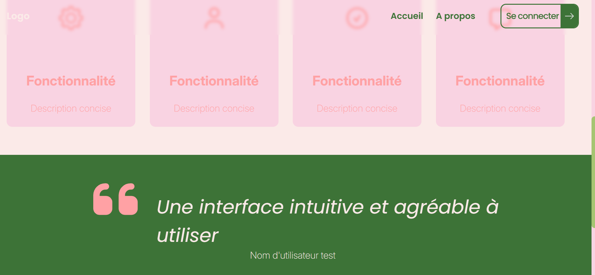
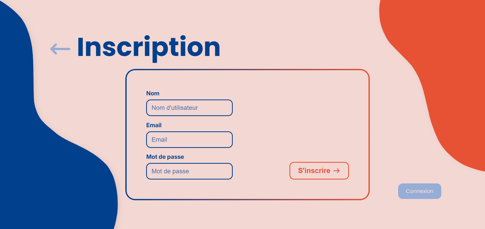

# MatchaDesign

> Projet en cours de développement (certaines fonctionnalités sont en construction.)

> Projet backend d'apprentissage visant à mettre en place un serveur Node.js avec Express, relié à une base de données SQLite3, et connecté à un frontend déjà existant.

> Mise en place d'un profil et d'une session utilisateur personnalisé (dont theme)

## Illustration

Theme Lemon :


Theme Forest :

Theme Ocean :


## Inspiration 
- Palette de couleur sur pinterest
- De nombreux projet moderne sur dribble

## Fonctionnalités actuelles
- API REST avec routes GET et POST
- Base de données SQLite3 stockée en local (`./database/inscriptionNews.db`)
- Création automatique des tables :
  - **users** : gestion des utilisateurs (username, email, mot de passe hashé)
  - **userProfil** : informations de profil liées à un utilisateur (avatar, description, job, bio, date de naissance, langue, thème)
  - **newsletter** : inscription à la newsletter (email unique)
- Tests des endpoints avec Postman

## Technologies
- Node.js / Express
- SQLite3 (PostgreSQL à venir)
- JavaScript (ES6+)
- Postman (tests API)

## Dépendances
- express
- body-parser
- cors
- express-session
- helmet
- morgan
- bcrypt
- sqlite3

## Installation
```bash
# Cloner le projet
git clone https://github.com/BuonomoLea/MatchaDesign.git

# Installer les dépendances
npm install

# Lancer le serveur
npm start

# Rechargement automatique
npm run dev
```
